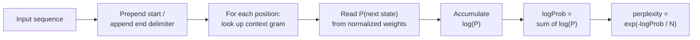

Training a Markov chain is only half the job. Once you have a model, you need to answer questions like: Is my training data rich enough? Are generated sequences plausible? Which of two datasets produces better output?

acausal provides three analysis tools for this:

- **`getStats()`** -- structural metrics about the chain itself
- **`score()`** -- log probability and perplexity for a specific sequence
- **`analyze()`** -- Monte Carlo sampling to discover sources and sinks

## Chain statistics

`getStats()` returns a `MarkovChainStats` object describing the structure of the trained model.

```typescript
import { MarkovChain } from 'acausal';

const chain = new MarkovChain({
  maxOrder: 3,
  sequences: [
    ['s', 'u', 'n', 'n', 'y'],
    ['s', 'u', 'n', 'd', 'a', 'y'],
    ['s', 'a', 't', 'u', 'r', 'd', 'a', 'y'],
    ['m', 'o', 'n', 'd', 'a', 'y'],
  ],
});

const stats = chain.getStats();
console.log(stats);
// {
//   gramCount: 42,
//   sequenceCount: 4,
//   orderRange: [1, 3],
//   avgDegreeIn: 1.5,
//   avgDegreeOut: 1.5,
// }
```

### Interpreting the fields

| Field | Meaning |
|-------|---------|
| `gramCount` | Total n-grams in the model. More grams means a richer model with more possible transitions. |
| `sequenceCount` | Number of training sequences added. Only available when sequences were not stripped during serialization. |
| `orderRange` | `[minOrder, maxOrder]` -- the range of n-gram orders present. A chain with `maxOrder: 3` will contain unigrams, bigrams, and trigrams. |
| `avgDegreeIn` | Average number of incoming transitions per gram. Higher values mean more ways to reach each state. |
| `avgDegreeOut` | Average number of outgoing transitions per gram. Higher values mean more branching, producing more diverse output. |

A chain with low `avgDegreeOut` (close to 1.0) will generate sequences that closely mirror the training data. A chain with higher values will produce more novel combinations.

The static API operates directly on DTOs:

```typescript
const dto = chain.serialize();
const stats = MarkovChain.getStats(dto);
```

## Sequence scoring

`score()` evaluates how well a sequence fits a trained model. It returns an `MCSequenceScore` with four metrics.

```typescript
const chain = new MarkovChain({
  maxOrder: 2,
  sequences: [
    ['j', 'o', 'h', 'n'],
    ['j', 'a', 'n', 'e'],
    ['j', 'a', 'm', 'e', 's'],
    ['j', 'e', 'n', 'n', 'y'],
  ],
});

const good = chain.score(['j', 'a', 'n', 'e']);
console.log(good);
// {
//   sequence: ['j', 'a', 'n', 'e'],
//   logProb: -3.47,
//   perplexity: 1.58,
//   normalized: -0.69,
//   isValid: true,
// }

const bad = chain.score(['z', 'z', 'z']);
console.log(bad);
// {
//   sequence: ['z', 'z', 'z'],
//   logProb: 0,
//   perplexity: Infinity,
//   normalized: -Infinity,
//   isValid: false,
// }
```

### How scoring works

The scorer wraps the input sequence with start and end delimiters, then walks through the sequence one state at a time. At each step it looks up the current context in the gram dictionary and reads the normalized probability of the actual next state.



### Understanding the metrics

| Metric | Formula | Interpretation |
|--------|---------|---------------|
| `logProb` | `sum(log(P(state_i \| context)))` | Total log likelihood. More negative means less probable. |
| `normalized` | `logProb / transitions` | Average log probability per transition. Comparable across different sequence lengths. |
| `perplexity` | `exp(-logProb / transitions)` | Effective branching factor. A perplexity of 2.0 means the model is, on average, choosing between 2 equally likely options at each step. Lower is more predictable. |
| `isValid` | -- | `false` if no valid transitions were found at all (the sequence is completely foreign to the model). |

You can optionally pass an `order` argument to control the context window size used during scoring:

```typescript
// Score using bigrams only, even if the chain has higher-order grams
const bigramScore = chain.score(['j', 'a', 'n', 'e'], 2);
```

## Analysis

`analyze()` performs Monte Carlo sampling to discover which states a chain tends to start from (sources) and end at (sinks), given a starting point.

```typescript
const chain = new MarkovChain({
  seed: 42,
  maxOrder: 2,
  sequences: [
    ['sunny', 'cloudy', 'rainy'],
    ['sunny', 'sunny', 'cloudy'],
    ['cloudy', 'rainy', 'sunny'],
    ['rainy', 'cloudy', 'sunny'],
  ],
});

const result = chain.analyze({
  start: ['cloudy'],
  samples: 500,
});

console.log(result);
// {
//   sequence: ['cloudy'],
//   sources: { sunny: 0.62, cloudy: 0.24, rainy: 0.14 },
//   sinks:   { sunny: 0.48, rainy: 0.30, cloudy: 0.22 },
// }
```

For each sample, `analyze()` generates one forward sequence and one backward sequence from the start point. It tallies the final state of each forward run (sinks) and the first state of each backward run (sources), then normalizes the counts into probabilities.

### Options

| Option | Default | Description |
|--------|---------|-------------|
| `samples` | `1000` | Number of forward/backward sequence pairs to generate. More samples = more stable results. |
| `normalize` | `true` | When `true`, counts are normalized to probabilities summing to 1.0. Set to `false` to get raw counts. |
| `order` | chain's `maxOrder` | N-gram order used during generation. |
| `min` | `1` | Minimum sequence length per sample. |
| `max` | `100` | Maximum sequence length per sample. |
| `strict` | `true` | When `false`, allows dynamic order fallback if the exact n-gram is not found. |
| `mask` | -- | States to exclude from generation. |

:::caution[PRNG side effect]
`analyze()` advances the random engine state by generating `samples * 2` sequences. If you need deterministic generation after analysis, clone the chain first or use a separate instance.
:::

The static API:

```typescript
const result = MarkovChain.analyze({
  model: chain.dto,
  start: ['cloudy'],
  samples: 500,
  engine: new Random({ seed: 99 }),
});
```

## Practical examples

### Comparing training datasets

Use `getStats()` to understand how different datasets shape a model before generating output.

```typescript
import { MarkovChain } from 'acausal';

const latinNames = ['marcus', 'julius', 'aurelia', 'octavia', 'cassius'];
const norseNames = ['sigurd', 'freya', 'bjorn', 'astrid', 'ragnar'];

const latinChain = new MarkovChain({
  maxOrder: 3,
  sequences: latinNames.map(n => n.split('')),
});

const norseChain = new MarkovChain({
  maxOrder: 3,
  sequences: norseNames.map(n => n.split('')),
});

const latinStats = latinChain.getStats();
const norseStats = norseChain.getStats();

console.log(`Latin:  ${latinStats.gramCount} grams, avg out-degree ${latinStats.avgDegreeOut.toFixed(2)}`);
console.log(`Norse:  ${norseStats.gramCount} grams, avg out-degree ${norseStats.avgDegreeOut.toFixed(2)}`);

// A higher avgDegreeOut suggests more diverse generation.
// A higher gramCount means the model captured more patterns.
```

### Filtering implausible names

Generate a batch of names and keep only those below a perplexity threshold.

```typescript
import { MarkovChain } from 'acausal';

const names = ['alice', 'alison', 'amanda', 'amber', 'andrea', 'angela', 'anna'];
const chain = new MarkovChain({
  seed: 7,
  maxOrder: 3,
  sequences: names.map(n => n.split('')),
});

const candidates: string[] = [];

for (let i = 0; i < 20; i++) {
  const seq = chain.generate({ order: 3, min: 3, max: 8, strict: false });
  const { perplexity, isValid } = chain.score(seq);

  if (isValid && perplexity < 3.0) {
    candidates.push(seq.join(''));
  }
}

console.log('Plausible names:', candidates);
// Only names that fit the learned patterns pass the filter.
```

### Ranking generated output by perplexity

When you need the *best* output from a batch, sort by perplexity.

```typescript
import { MarkovChain } from 'acausal';

const words = ['crystal', 'crimson', 'chrome', 'craft', 'crest', 'crown'];
const chain = new MarkovChain({
  seed: 42,
  maxOrder: 3,
  sequences: words.map(w => w.split('')),
});

const generated = Array.from({ length: 50 }, () =>
  chain.generate({ order: 3, min: 4, max: 8, strict: false })
);

const scored = generated
  .map(seq => ({ word: seq.join(''), ...chain.score(seq) }))
  .filter(s => s.isValid)
  .sort((a, b) => a.perplexity - b.perplexity);

// Top 5 most plausible generated words
console.log(scored.slice(0, 5).map(s => `${s.word} (perplexity: ${s.perplexity.toFixed(2)})`));
```

Lower perplexity means the sequence closely follows the patterns in the training data. Higher perplexity means the sequence is more surprising. The right threshold depends on your use case -- strict name generators might reject anything above 2.0, while a creative word generator might allow up to 5.0.
