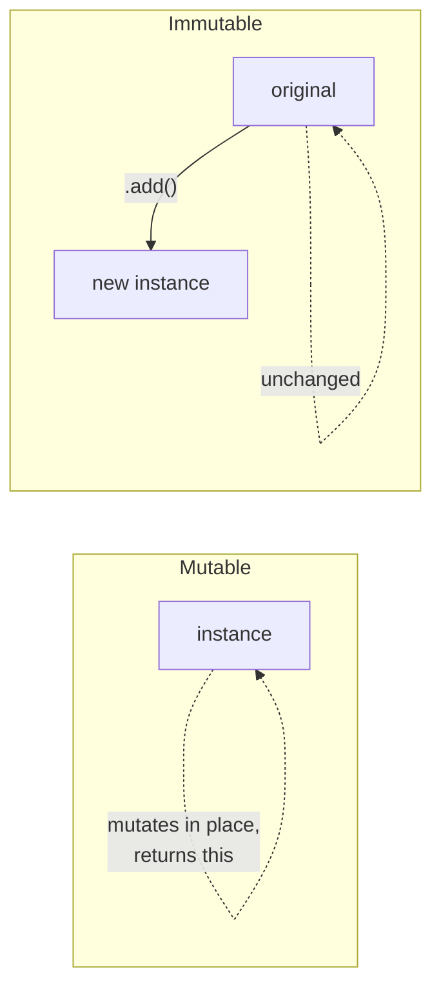

Every core structure in acausal has an **immutable variant** that returns a new instance from mutating methods instead of modifying internal state. This makes them safe to share across module boundaries, pass through pure functions, and use in undo/history systems.

| Mutable | Immutable |
|---------|-----------|
| `Distribution` | `ImmutableDistribution` |
| `MarkovChain` | `ImmutableMarkovChain` |
| `MultiDimMarkovChain` | `ImmutableMultiDimMarkovChain` |

## Mutable vs immutable

Mutable instances mutate internal state and return `this` for chaining. Immutable instances clone their data, apply the change, and return a **new instance** -- the original is never touched.



Use mutable when you own the instance and want efficient chaining. Use immutable when you need safety guarantees: shared references, functional pipelines, or state history.

## ImmutableDistribution

Create one directly or freeze an existing mutable distribution.

```typescript
import { Distribution, ImmutableDistribution } from 'acausal';

// Direct construction
const loot = new ImmutableDistribution({
  seed: 1,
  source: { common: 60, uncommon: 25, rare: 10, epic: 4, legendary: 1 },
});

// Mutating methods return new instances
const withMythic = loot.add('mythic', 0.1);

loot.source;      // { common: 60, ... legendary: 1 } -- unchanged
withMythic.source; // { common: 60, ... legendary: 1, mythic: 0.1 }
```

The full set of methods that return new instances:

| Method | Description |
|--------|-------------|
| `add(key, value)` | Add or increment a single key |
| `addValues(obj)` | Add multiple key-value pairs |
| `remove(keys)` | Remove one or more keys |

Non-mutating methods like `pick()`, `pickOne()`, `serialize()`, and `clone()` work identically to the mutable version.

## ImmutableMarkovChain

Same pattern applied to Markov chains. Every method that would modify training data returns a new chain.

```typescript
import { ImmutableMarkovChain } from 'acausal';

const chain = new ImmutableMarkovChain({
  seed: 42,
  maxOrder: 2,
  sequences: [['a', 'b', 'c']],
});

// addSequence returns a new chain -- original is untouched
const expanded = chain.addSequence(['d', 'e', 'f']);

// Generation works the same as MarkovChain
const result = expanded.generate({ min: 2, max: 5, order: 2 });
```

Methods that return new instances:

| Method | Description |
|--------|-------------|
| `addSequence(seq)` | Train on a single sequence |
| `addSequences(seqs)` | Train on multiple sequences |
| `addEdge(gram, lastId, nextId, order)` | Add a single transition edge |
| `interpolate(other, alpha, opts?)` | Blend with another chain |

## ImmutableMultiDimMarkovChain

The multi-dimensional chain follows the same contract.

```typescript
import { ImmutableMultiDimMarkovChain } from 'acausal';

interface GameState {
  action: string;
  intensity: number;
}

const chain = new ImmutableMultiDimMarkovChain<GameState>({
  seed: 7,
  maxOrder: 1,
  stateKey: (s: GameState) => `${s.action}_${s.intensity}`,
});

const trained = chain
  .addSequence([
    { action: 'walk', intensity: 1 },
    { action: 'run', intensity: 3 },
    { action: 'fight', intensity: 8 },
  ])
  .addSequence([
    { action: 'walk', intensity: 1 },
    { action: 'sneak', intensity: 2 },
  ]);

// original `chain` still has no training data
```

## freeze() / toMutable() bridge

You can convert between mutable and immutable at any time. This lets you build with mutable chaining, then lock things down for safe sharing.

```typescript
import { Distribution, MarkovChain } from 'acausal';

// Mutable -> Immutable
const dist = new Distribution({ seed: 1, source: { a: 10, b: 20 } });
const frozen = dist.freeze(); // ImmutableDistribution

// Immutable -> Mutable
const thawed = frozen.toMutable(); // Distribution
thawed.add('c', 30); // mutates in place again
```

For `MarkovChain` and `MultiDimMarkovChain`, `freeze()` is **async** because it uses a dynamic import to avoid bundling the immutable class when it is not needed:

```typescript
const chain = new MarkovChain({ seed: 1, maxOrder: 2, sequences });
const frozen = await chain.freeze(); // ImmutableMarkovChain

const mutable = frozen.toMutable(); // back to MarkovChain
```

Both directions produce a fully independent copy -- modifying one side never affects the other.

## PRNG forking

When an immutable method returns a new instance, the PRNG engine is cloned via `engine.clone()`. This means the original and the fork start with **identical** PRNG state. They will produce the same random sequence until their draw counts diverge (which typically happens immediately as you use them independently).

```typescript
const base = new ImmutableDistribution({
  seed: 99,
  source: { heads: 1, tails: 1 },
});

const fork = base.add('edge', 0.01);

// Both engines start at the same state.
// The first pick from each will be identical if the
// normalized distributions happen to match.
// After that, usage diverges naturally.
base.pickOne(); // draw #1 from base's engine
fork.pickOne(); // draw #1 from fork's engine (same seed+uses)
base.pickOne(); // draw #2 -- now diverged from fork
```

If you need independent randomness immediately after forking, advance one engine or provide a different seed.

## Practical patterns

### Safe sharing across modules

Pass an immutable instance to other modules without worrying about unexpected mutations:

```typescript
// config.ts
import { ImmutableDistribution } from 'acausal';

export const lootTable = new ImmutableDistribution({
  seed: 1,
  source: { common: 60, uncommon: 25, rare: 10, epic: 4, legendary: 1 },
});

// dungeon.ts
import { lootTable } from './config';

// This returns a new instance -- lootTable is never modified
const bossLoot = lootTable.add('mythic', 0.5);
```

### Functional composition

Chain transformations without intermediate variables:

```typescript
const base = new ImmutableMarkovChain({
  seed: 1,
  maxOrder: 2,
  sequences: englishNames,
});

const blended = base
  .addSequences(japaneseNames)
  .addSequences(irishNames);

// base still only has englishNames
// blended has all three
```

### Undo / history via reference keeping

Since each mutation returns a new instance, keeping references gives you free undo:

```typescript
const history: ImmutableDistribution[] = [];

let current = new ImmutableDistribution({
  seed: 1,
  source: { a: 1, b: 2 },
});

history.push(current);
current = current.add('c', 3);

history.push(current);
current = current.remove('a');

// Undo: just pop
current = history.pop()!;
// current.source => { a: 1, b: 2, c: 3 }
```

This works because no instance is ever mutated -- every entry in `history` is a stable snapshot.
