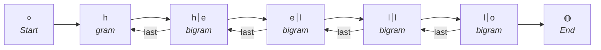
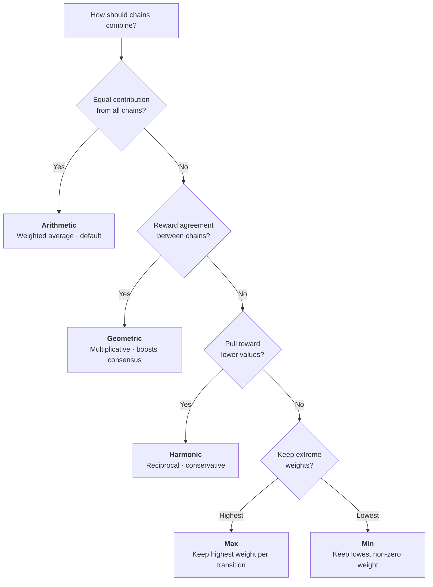

A **Markov Chain** is a mathematical model where the future state depends only on the present state. acausal builds statistical n-gram models from sample data that can then generate new sequences resembling the training data.

A key property: sample data can be "mixed" like paint. Train on Irish and Japanese names together, and the model generates names that blend the two.

### How grams work

Each sequence is broken into overlapping n-grams. Every gram tracks bidirectional transitions: which states can come **next** and which states came **last**. Start (`○`) and end (`◍`) delimiters mark sequence boundaries. Gram IDs join states with the `⏐` separator.



> **Reading the diagram:** Forward arrows show `next` transitions (used by `generate()`). Backward arrows show `last` transitions (used by `generate({ direction: 'last' })`). The sequence `['h','e','l','l','o']` produces unigrams and bigrams that each store both directions.

## Name generator example

```typescript
import { MarkovChain } from 'acausal';

const jpNames = ['honoka', 'akari', 'himari', 'mei', 'ema'];
const ieNames = ['grace', 'fiadh', 'emily', 'sophie', 'ava'];
const names = [...jpNames, ...ieNames];

const src = names.map(name => name.split(''));

const chain = new MarkovChain({
  seed: 33,
  maxOrder: 2,
  sequences: src,
});

for (let i = 0; i < 3; i++) {
  const pick = chain.generate({
    min: 4,
    max: 10,
    order: 2,
    strict: false,
  });
  console.log(pick.join(''));
}
// sophimari
// emari
// hie
```

## Generic types (v3.0)

`MarkovChain<T>` is now generic for type-safe states:

```typescript
type Weather = 'sunny' | 'cloudy' | 'rainy';
const chain = new MarkovChain<Weather>({ maxOrder: 2 });
```

## Batch operations

Add multiple sequences efficiently with `MarkovChainBatch`, which avoids per-sequence cloning:

```typescript
const chain = new MarkovChain({ maxOrder: 2 });

// Single clone at commit time
const updated = chain.batch()
  .addSequence(['a', 'l', 'i', 'c', 'e'])
  .addSequence(['b', 'o', 'b'])
  .addSequence(['c', 'h', 'a', 'r', 'l', 'i', 'e'])
  .commit();
```

### Why batch matters

Every call to `chain.addSequence()` follows the static clone-on-write pattern: the internal DTO is cloned, the clone is mutated, and the new DTO replaces the old one. When adding N sequences individually, this produces N clones. `MarkovChainBatch` clones the model **once** in its constructor, applies all mutations directly to that single clone, and then wraps the result in a new `MarkovChain` at `commit()` time.

```typescript
// Individual: N clones (one per addSequence call)
const chain = new MarkovChain({ maxOrder: 2 });
chain.addSequence(['a', 'l', 'i', 'c', 'e']);   // clone #1
chain.addSequence(['b', 'o', 'b']);               // clone #2
chain.addSequence(['c', 'h', 'a', 'r', 'l', 'i', 'e']); // clone #3

// Batch: 1 clone total
const batched = chain.batch()
  .addSequence(['a', 'l', 'i', 'c', 'e'])        // mutates clone directly
  .addSequence(['b', 'o', 'b'])                    // mutates clone directly
  .addSequence(['c', 'h', 'a', 'r', 'l', 'i', 'e']) // mutates clone directly
  .commit();                                        // wraps clone in new instance
```

For large training sets (hundreds or thousands of sequences), batch operations can be significantly faster.

### Batch API

| Method | Description |
|--------|-------------|
| `addSequence(seq, insert?)` | Add a single sequence with an optional insertion mode |
| `addSequences(seqs, insert?)` | Add multiple sequences at once |
| `addEdge(gram, lastId, nextId, order, weight?)` | Add an individual transition between states |
| `commit()` | Finalize all operations and return a new `MarkovChain` |
| `pending` | Read-only count of queued operations |
| `clear()` | Discard all pending operations (re-clones the original model) |

### Adding individual edges

`addEdge()` lets you define transitions directly without providing full sequences. This is useful when you have a transition graph rather than observed sequences:

```typescript
const chain = new MarkovChain({ maxOrder: 1 });
const updated = chain.batch()
  .addEdge('sunny', undefined, 'cloudy', 1)    // sunny -> cloudy
  .addEdge('cloudy', 'sunny', 'rainy', 1)      // sunny -> cloudy -> rainy
  .addEdge('rainy', 'cloudy', undefined, 1)     // cloudy -> rainy -> (end)
  .commit();
```

### Discarding pending work

If you need to abort a batch without applying its changes, call `clear()`. This re-clones the original model and resets the operation counter:

```typescript
const batch = chain.batch();
batch.addSequence(['x', 'y', 'z']);
console.log(batch.pending); // 1

batch.clear();
console.log(batch.pending); // 0
```

## Utility methods

```typescript
// Check if a gram exists
chain.hasGram(['a', 'b']);

// Get grams by order
const bigrams = chain.getGramsByOrder(2);

// Get chain statistics
const stats = chain.getStats();
console.log(`${stats.gramCount} grams, avg out-degree: ${stats.avgDegreeOut}`);
```

## Creating chains

### Instance workflow

```typescript
const weather = new MarkovChain({
  seed: 5,
  sequences: [
    ['sunny', 'sunny', 'sunny', 'cloudy', 'cloudy', 'sunny', 'sunny'],
    ['sunny', 'cloudy', 'cloudy', 'cloudy', 'cloudy', 'rainy', 'cloudy'],
  ],
  maxOrder: 2,
});

const weatherClone = weather.clone();
const weatherData = weather.serialize();
```

### Static workflow

```typescript
let weatherData = MarkovChain.new({
  seed: 5,
  sequences: src,
  maxOrder: 2,
});

const weatherClone = MarkovChain.clone(weatherData);
```

## Adding sequences

Sequences have start/end markers by default. You can control this with insertion modes:

| Mode | Start marker | End marker | Use case |
|------|:---:|:---:|------|
| *(default)* | Yes | Yes | Normal training data |
| `'middle'` | No | No | Adjust transitions without affecting start/end probabilities |
| `'start'` | Yes | No | Allow new starting states |
| `'end'` | No | Yes | Allow new ending states |

```typescript
// Normal — adds start and end markers
weather.addSequence(['sunny', 'cloudy', 'rainy', 'cloudy']);

// Middle — no markers, won't affect start/end probabilities
weather.addSequence(['stormy', 'cloudy'], 'middle');

// Start — allows starting on 'rainy'
weather.addSequence(['rainy'], 'start');

// End — allows ending on 'stormy'
weather.addSequence(['stormy'], 'end');
```

## Generating sequences

### Single picks

```typescript
// Next state from start
weather.pick();                          // => 'rainy'

// Previous state from end
weather.pick(false, false);              // => 'cloudy'

// Next state after 'cloudy'
weather.pick(['cloudy']);                 // => 'sunny'

// Next after 'stormy', excluding 'cloudy'
weather.pick(['stormy'], true, ['cloudy']); // => 'rainy'

// Convenience aliases
weather.next(['stormy']);                 // => 'cloudy'
weather.last(['stormy']);                 // => 'rainy'
```

### Sequence generation

```typescript
// At least 3 days
weather.generate({ order: 1, min: 3 });
// => ['cloudy', 'sunny', 'cloudy', 'sunny', 'sunny']

// Exactly 5 days starting on 'sunny'
weather.generate({ order: 1, min: 5, max: 5, start: ['sunny'] });
// => ['sunny', 'cloudy', 'cloudy', 'sunny', 'sunny']

// Exclude certain states with a mask
weather.generate({ order: 1, min: 5, max: 5, mask: ['sunny', 'cloudy'] });
// => ['rainy', 'rainy', 'rainy', 'stormy', 'rainy']

// Generate backward (previous days)
weather.generate({ order: 1, min: 4, max: 4, start: ['stormy'], direction: 'last' });
// => ['rainy', 'stormy', 'rainy', 'stormy']
```

## Chain blending

Combine multiple chains with weighted probabilities. Useful for genetics simulation, loot table mixing, and style interpolation.

### Basic blending

```typescript
const chain1 = new MarkovChain({ maxOrder: 2 });
chain1.addSequences([['a', 'b', 'c'], ['a', 'b', 'd']]);

const chain2 = new MarkovChain({ maxOrder: 2 });
chain2.addSequences([['x', 'y', 'z'], ['x', 'y', 'w']]);

const blended = MarkovChain.blend([
  { chain: chain1, weight: 0.5 },
  { chain: chain2, weight: 0.5 },
]);
```

### Interpolation (two chains)

```typescript
// 0 = all chain1, 1 = all chain2
const hybrid = chain1.interpolate(chain2, 0.3); // 70% chain1, 30% chain2
```

### Blend strategies

| Strategy | Description |
|----------|-------------|
| `arithmetic` | Weighted average (default) |
| `geometric` | Multiplicative combination |
| `harmonic` | Reciprocal weighting |
| `max` | Maximum probability per transition |
| `min` | Minimum non-zero probability |

```typescript
const geometric = MarkovChain.blend(chains, { strategy: 'geometric' });
```

#### How each strategy works

- **Arithmetic** computes the weighted sum of source weights: `w1*v1 + w2*v2`. This is the standard weighted average and the default strategy. It produces balanced blends where every chain contributes proportionally.

- **Geometric** raises each value to the power of its weight and multiplies: `v1^w1 * v2^w2`. This naturally boosts transitions that both chains agree on and suppresses transitions that only one chain has. Useful for finding consensus between sources.

- **Harmonic** computes the weighted harmonic mean: `1 / (w1/v1 + w2/v2)`. This is conservative -- it pulls results toward lower values. Useful when you want the blended model to be cautious about high-probability transitions.

- **Max** takes the highest source weight across all chains for each transition. This produces a model that can do anything any of its sources can do, preserving the dominant transitions from each chain.

- **Min** takes the lowest non-zero source weight for each transition. This produces a model restricted to transitions that all chains agree on, keeping only the weakest signal. Zero values are excluded (a state absent from one chain does not force the output to zero).

#### Example: same inputs, different strategies

Given two chains blended at equal weight (0.5 each), where a transition has source weight **8** in chain A and **2** in chain B:

| Strategy | Result | Reasoning |
|----------|--------|-----------|
| `arithmetic` | **5.0** | `0.5 * 8 + 0.5 * 2 = 5` |
| `geometric` | **4.0** | `8^0.5 * 2^0.5 = 4` |
| `harmonic` | **3.2** | `1 / (0.5/8 + 0.5/2) = 3.2` |
| `max` | **8.0** | `max(8, 2) = 8` |
| `min` | **2.0** | `min(8, 2) = 2` |

Notice how geometric and harmonic produce lower values than arithmetic for skewed inputs, making them more conservative blending choices.

#### Zero-value behavior

Geometric and harmonic strategies only apply to states that are **present** (non-zero) in a chain. When a state has a zero weight in one chain, that chain is excluded from the calculation for that state, and the remaining chains' weights are renormalized over the participating subset. This is mathematically necessary -- the geometric mean of zero is zero, and the harmonic mean is undefined for zero values. In practice, this means geometric and harmonic blending only considers chains that actually have an opinion about a given transition.

#### Choosing a strategy



### Filter low-weight states

```typescript
const filtered = MarkovChain.blend(chains, {
  minWeight: 0.1, // Only include states with >= 10% combined weight
});
```

### Practical example: character genetics

```typescript
const motherTraits = new MarkovChain({ maxOrder: 2 });
motherTraits.addSequences([
  ['black', 'brown', 'black'],
  ['brown', 'black', 'brown'],
]);

const fatherTraits = new MarkovChain({ maxOrder: 2 });
fatherTraits.addSequences([
  ['blonde', 'blonde', 'light-brown'],
  ['light-brown', 'blonde', 'blonde'],
]);

// Child inherits 50% from each parent
const childTraits = MarkovChain.blend([
  { chain: motherTraits, weight: 0.5 },
  { chain: fatherTraits, weight: 0.5 },
]);
```

## Multi-dimensional chains

`MultiDimMarkovChain<T>` preserves structured state objects instead of flattening to strings. Ideal for tile-based procedural generation, game state management, and spatial systems.

### Setup

```typescript
import { MultiDimMarkovChain, registerStateKey } from 'acausal';

interface TileState {
  terrain: string;
  x: number;
  y: number;
  biome: string;
}

// Register a named state key function (enables serialization)
registerStateKey<TileState>('tileKey', (s) => `${s.terrain}_${s.x}_${s.y}_${s.biome}`);

const tileChain = new MultiDimMarkovChain<TileState>({
  maxOrder: 2,
  stateKey: 'tileKey',
});
```

### Training and generation

```typescript
const updated = tileChain.addSequence([
  { terrain: 'grass', x: 0, y: 0, biome: 'plains' },
  { terrain: 'forest', x: 1, y: 0, biome: 'woodland' },
  { terrain: 'water', x: 2, y: 0, biome: 'lake' },
]);

// Generate returns structured states, not strings
const tiles = updated.generate({ order: 2, min: 3, max: 5 });
tiles[0].terrain; // 'grass'
tiles[0].x;       // 0
```

### The state key registry

A `MultiDimMarkovChain` needs a function that converts structured state objects into unique string keys. Internally, these keys are used as gram IDs in a standard `MarkovChain<string>`. However, functions cannot be serialized to JSON, so the chain stores the **name** of the state key function rather than the function itself. At deserialization time, the name is looked up in a global registry.

Three functions manage the registry:

| Function | Description |
|----------|-------------|
| `registerStateKey(name, fn)` | Register a named state key function. Throws if `name` is already registered with a different function. |
| `getStateKey(name)` | Look up a registered function by name. Returns `undefined` if not found. |
| `unregisterStateKey(name)` | Remove a registered function. Returns `true` if found and removed. |

```typescript
import { registerStateKey, getStateKey, unregisterStateKey } from 'acausal';

// Register before constructing or deserializing any chain that uses this key
registerStateKey<TileState>('tileKey', (s) => `${s.terrain}_${s.x}_${s.y}_${s.biome}`);

// Look up at any time
const fn = getStateKey<TileState>('tileKey'); // the registered function

// Clean up if needed (e.g., in tests)
unregisterStateKey('tileKey'); // true
```

Registration must happen **before** you construct a `MultiDimMarkovChain` with a string `stateKey`, and before you call `fromDTO()` to deserialize one. If the name is not in the registry, both operations throw an error with a descriptive message.

You can also pass the function directly to the constructor alongside a `stateKeyName` for serialization:

```typescript
const chain = new MultiDimMarkovChain<TileState>({
  maxOrder: 2,
  stateKey: (s) => `${s.terrain}_${s.x}_${s.y}_${s.biome}`,
  stateKeyName: 'tileKey', // stored in the DTO for later lookup
});
```

### The state store

Internally, `MultiDimMarkovChain` maintains a `stateStore` -- a plain object mapping string keys to the original structured state objects. When you add a sequence, each state is converted to its key via the state key function, and the key-to-state mapping is stored. During generation, the internal `MarkovChain<string>` produces string keys, which are then resolved back to full state objects through this store.

This means:
- The state store grows as you add more unique states
- Duplicate keys overwrite previous entries (the last state object with that key wins)
- Your state key function must produce **unique keys** for states that should be treated as distinct

### Serialization

The DTO includes the internal chain data, the full state store, and the `stateKeyName`:

```typescript
const dto = chain.serialize();
// dto.stateKeyName  -> 'tileKey'
// dto.stateStore    -> { 'grass_0_0_plains': { terrain: 'grass', ... }, ... }
// dto.internalChain -> MarkovChainDTO (the underlying string-based chain)
```

To deserialize, the state key function must be in the registry:

```typescript
// Ensure the key is registered before deserializing
registerStateKey<TileState>('tileKey', (s) => `${s.terrain}_${s.x}_${s.y}_${s.biome}`);

const restored = MultiDimMarkovChain.fromDTO<TileState>(dto);
```

If the function is not registered, you can pass it explicitly as a second argument:

```typescript
const restored = MultiDimMarkovChain.fromDTO<TileState>(
  dto,
  (s) => `${s.terrain}_${s.x}_${s.y}_${s.biome}`
);
```

### Immutable variant

`ImmutableMultiDimMarkovChain<T>` returns new instances from mutating methods instead of modifying internal state. Use it when you need safe sharing or functional patterns:

```typescript
const chain = new MultiDimMarkovChain<TileState>({
  maxOrder: 2,
  stateKey: 'tileKey',
});

// Convert mutable to immutable
const frozen = await chain.freeze();

// addSequence returns a new instance; `frozen` is unchanged
const updated = frozen.addSequence([
  { terrain: 'grass', x: 0, y: 0, biome: 'plains' },
  { terrain: 'forest', x: 1, y: 0, biome: 'woodland' },
]);

// Convert back to mutable when needed
const mutable = (updated as ImmutableMultiDimMarkovChain<TileState>).toMutable();
```

## Sequence scoring

Calculate likelihood scores for sequences — useful for quality filtering, autocomplete ranking, and validation.

```typescript
const score = chain.score(['j', 'o', 'h', 'n']);
// {
//   sequence: ['j', 'o', 'h', 'n'],
//   logProb: -8.3,
//   perplexity: 12.4,     // Lower is better
//   isValid: true,
//   normalized: -2.1      // Normalized by sequence length
// }
```

Static dual-API:

```typescript
const model = MarkovChain.new([['j', 'o', 'h', 'n'], ['j', 'a', 'n', 'e']], 2);
const score = MarkovChain.score(model, ['j', 'o', 'h', 'n']);
```

## Constraint-based generation

Control generated output with constraints:

```typescript
const result = chain.generate({
  order: 2,
  max: 20,
  constraints: {
    minLength: 5,
    maxLength: 8,
    mustContain: ['a'],
    mustNotContain: ['x', 'z'],
    pattern: /^[a-z]+$/,
    validator: (seq) => !/(.)\\1{2,}/.test(seq.join('')),
    maxRetries: 200,
  },
});
```

### Constraint types

| Constraint | Description |
|-----------|-------------|
| `minLength` / `maxLength` | Sequence length bounds |
| `mustContain` | Required elements |
| `mustNotContain` | Forbidden elements |
| `pattern` | Regex the joined sequence must match |
| `validator` | Custom function returning `true`/`false` |
| `maxRetries` | Maximum generation attempts |
