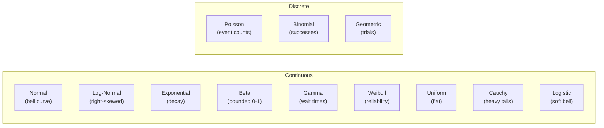

**RandomSampler** wraps acausal's seeded MT19937 PRNG with methods for sampling from common probability distributions. Every call is deterministic given the same seed, making it ideal for procedural generation that needs to be reproducible.

Use `RandomSampler` when you need statistical distributions (normal, exponential, beta, etc.) or convenience methods like `shuffle()` and `weightedChoice()`. Use the lower-level `Random` class when you only need raw integers and floats.

## Distribution shape gallery



## Basic usage

```typescript
import { RandomSampler } from 'acausal';

// Create with a seed for reproducibility
const sampler = new RandomSampler({ seed: 42 });

// Random float in [0, 1)
sampler.next();     // 0.4657...

// Random float in [min, max)
sampler.float(5, 10);  // 7.832...

// Random integer in [min, max] (inclusive)
sampler.int(1, 20);    // 14

// Random boolean with probability of true (default 0.5)
sampler.bool();        // true
sampler.bool(0.8);     // true (80% chance)
```

Access the seed and use count at any time:

```typescript
sampler.seed;  // 42
sampler.uses;  // number of PRNG draws consumed so far
```

## Array operations

### choice / choices

```typescript
const colors = ['red', 'green', 'blue', 'yellow'];

// Pick one random element
sampler.choice(colors);
// => 'blue'

// Pick multiple with replacement (may repeat)
sampler.choices(colors, 3);
// => ['red', 'blue', 'red']
```

### shuffle

Returns a new shuffled array (Fisher-Yates). The original is not mutated.

```typescript
sampler.shuffle([1, 2, 3, 4, 5]);
// => [3, 1, 5, 2, 4]
```

### sample

Pick elements without replacement. If `count >= array.length`, returns a full shuffle.

```typescript
sampler.sample(['a', 'b', 'c', 'd', 'e'], 3);
// => ['c', 'a', 'e']
```

## Weighted selection

`weightedChoice()` picks a key from an object where values are weights. Weights do not need to sum to 1 -- they are treated proportionally.

```typescript
const biome = sampler.weightedChoice({
  forest: 40,
  desert: 25,
  ocean: 20,
  tundra: 10,
  volcanic: 5,
});
// => 'forest' (40% chance)
```

### Masking keys

Pass a mask array to exclude certain keys from selection:

```typescript
// Player already visited forest and ocean -- exclude them
const nextBiome = sampler.weightedChoice(
  { forest: 40, desert: 25, ocean: 20, tundra: 10, volcanic: 5 },
  ['forest', 'ocean']
);
// Picks from desert (25), tundra (10), volcanic (5) only
```

## Statistical distributions

### normal

Bell curve distribution using Box-Muller transform.

| Parameter | Default | Description |
|-----------|---------|-------------|
| `mu` | `0` | Mean (center) |
| `sigma` | `1` | Standard deviation (spread) |

```typescript
// Character height in cm: mean 170, std dev 7
const height = sampler.normal(170, 7);
// => 174.3
```

### clampedNormal

Normal distribution clamped to `[min, max]`. Always consumes exactly 2 PRNG draws (uses clamping, not rejection sampling).

| Parameter | Description |
|-----------|-------------|
| `mu` | Mean |
| `sigma` | Standard deviation |
| `min` | Lower bound |
| `max` | Upper bound |

```typescript
// Ability score: mean 10, std dev 3, clamped to [3, 18]
const stat = sampler.clampedNormal(10, 3, 3, 18);
// => 12
```

:::note
`truncatedNormal()` is a deprecated alias for `clampedNormal()`. The name was changed because this method clamps rather than truly truncating (which would use rejection sampling).
:::

### exponential

Models wait times, decay, inter-arrival intervals.

| Parameter | Default | Description |
|-----------|---------|-------------|
| `lambda` | `1` | Rate parameter (higher = shorter waits) |

```typescript
// Time until next enemy spawn (rate: 0.5 per second)
const waitTime = sampler.exponential(0.5);
// => 1.73 seconds
```

### poisson

Models the number of events in a fixed interval.

| Parameter | Description |
|-----------|-------------|
| `lambda` | Expected number of occurrences |

```typescript
// Number of critical hits in 10 attacks (expect ~2)
const crits = sampler.poisson(2);
// => 3
```

### binomial

Number of successes in `n` independent trials.

| Parameter | Description |
|-----------|-------------|
| `n` | Number of trials |
| `p` | Probability of success per trial |

```typescript
// How many of 20 arrows hit the target? (70% accuracy)
const hits = sampler.binomial(20, 0.7);
// => 15
```

### geometric

Number of trials until the first success.

| Parameter | Description |
|-----------|-------------|
| `p` | Probability of success per trial (must be in (0, 1]) |

```typescript
// How many lockpick attempts until success? (30% chance each)
const attempts = sampler.geometric(0.3);
// => 2
```

### beta

Produces values in [0, 1]. Useful for modeling probabilities, percentages, and proportions.

| Parameter | Description |
|-----------|-------------|
| `alpha` | Shape parameter (must be > 0) |
| `beta` | Shape parameter (must be > 0) |

```typescript
// NPC morale as a percentage (skewed toward high morale)
const morale = sampler.beta(5, 2);
// => 0.78
```

### gamma

Aggregate wait times. Sum of `k` independent exponential variables.

| Parameter | Default | Description |
|-----------|---------|-------------|
| `k` | -- | Shape parameter (must be > 0) |
| `theta` | `1` | Scale parameter |

```typescript
// Total time for 3 sequential tasks
const totalTime = sampler.gamma(3, 2.0);
// => 7.4
```

### weibull

Models reliability, failure times, and survival analysis.

| Parameter | Default | Description |
|-----------|---------|-------------|
| `k` | -- | Shape parameter |
| `a` | `1` | Scale parameter |
| `b` | `0` | Location parameter |

```typescript
// Equipment durability (k > 1 means increasing failure rate)
const lifetime = sampler.weibull(2, 100);
// => 83.6 hours
```

### cauchy

Heavy-tailed distribution. Useful for outlier-prone values -- no finite mean or variance.

| Parameter | Default | Description |
|-----------|---------|-------------|
| `a` | `0` | Location parameter |
| `b` | `1` | Scale parameter |

```typescript
// Wild price fluctuation in a market simulator
const priceShock = sampler.cauchy(0, 5);
// => -12.7
```

### logistic

Similar shape to normal but with heavier tails.

| Parameter | Default | Description |
|-----------|---------|-------------|
| `a` | `0` | Location parameter |
| `b` | `1` | Scale parameter |

```typescript
// Terrain elevation with occasional extremes
const elevation = sampler.logistic(100, 15);
// => 108.3
```

### logNormal

Models multiplicative processes -- prices, sizes, durations that can't be negative.

| Parameter | Default | Description |
|-----------|---------|-------------|
| `mu` | `0` | Mean of the underlying normal distribution |
| `sigma` | `1` | Standard deviation of the underlying normal |

```typescript
// Item price in gold (always positive, right-skewed)
const price = sampler.logNormal(3, 0.5);
// => 24.8
```

### uniform

Flat distribution over `[min, max)`.

| Parameter | Default | Description |
|-----------|---------|-------------|
| `min` | `0` | Minimum value |
| `max` | `1` | Maximum value |

```typescript
// Random angle in degrees
const angle = sampler.uniform(0, 360);
// => 217.4
```

## Data-driven sampling

`sampleDistribution()` takes a `DistributionParams` object and delegates to the appropriate method. This enables config-driven generation where distribution shapes are defined in data files (JSON, YAML, databases) rather than code.

```typescript
import { RandomSampler, type DistributionParams } from 'acausal';

const sampler = new RandomSampler({ seed: 99 });

// Define distributions as data
const heightDist: DistributionParams = { type: 'normal', mu: 170, sigma: 7 };
const ageDist: DistributionParams = { type: 'uniform', min: 18, max: 65 };
const luckDist: DistributionParams = { type: 'beta', alpha: 2, beta: 5 };

sampler.sampleDistribution(heightDist);  // 168.2
sampler.sampleDistribution(ageDist);     // 41
sampler.sampleDistribution(luckDist);    // 0.31
```

### Config-driven character generator

```typescript
// character-config.json
const config = {
  height: { type: 'normal' as const, mu: 170, sigma: 8 },
  weight: { type: 'normal' as const, mu: 70, sigma: 12 },
  age: { type: 'uniform' as const, min: 18, max: 80 },
  luck: { type: 'beta' as const, alpha: 2, beta: 5 },
  encountersPerDay: { type: 'poisson' as const, lambda: 3 },
};

function generateCharacter(sampler: RandomSampler) {
  return Object.fromEntries(
    Object.entries(config).map(([key, dist]) => [
      key,
      sampler.sampleDistribution(dist),
    ])
  );
}

const sampler = new RandomSampler({ seed: 42 });
const character = generateCharacter(sampler);
// { height: 174.3, weight: 65.1, age: 53, luck: 0.28, encountersPerDay: 4 }
```

All supported `DistributionParams` types:

| `type` | Parameters |
|--------|-----------|
| `'uniform'` | `min`, `max` |
| `'normal'` | `mu`, `sigma` |
| `'logNormal'` | `mu`, `sigma` |
| `'exponential'` | `lambda` |
| `'poisson'` | `lambda` |
| `'binomial'` | `n`, `p` |
| `'geometric'` | `p` |
| `'beta'` | `alpha`, `beta` |
| `'gamma'` | `k`, `theta?` |
| `'bernoulli'` | `p` |
| `'weibull'` | `k`, `a?`, `b?` |
| `'cauchy'` | `a?`, `b?` |
| `'logistic'` | `a?`, `b?` |

## Serialization

RandomSampler state is fully serializable. The DTO captures the seed and use count, which is enough to reproduce the exact PRNG state.

```typescript
const sampler = new RandomSampler({ seed: 42 });

// Use it for a while
sampler.normal(0, 1);
sampler.int(1, 100);

// Serialize to plain object
const dto = sampler.serialize();
// { seed: 42, uses: 627 }

// Restore exact state later
const restored = new RandomSampler(dto);
// restored.next() === what sampler.next() would produce
```

### clone

Create a copy, optionally resetting the use count:

```typescript
// Exact copy (same state)
const copy = sampler.clone();

// Copy with reset use count
const fresh = sampler.clone(0);
```

### Static factory

```typescript
// Create with seed
const s1 = RandomSampler.create(42);

// Create with seed and use count
const s2 = RandomSampler.create(42, 1000);

// Create with entropy (random seed)
const s3 = RandomSampler.create();
```

## Practical examples

### RPG character stat generation

Generate a full set of character stats using different distributions for different attributes:

```typescript
import { RandomSampler } from 'acausal';

function rollCharacter(seed: number) {
  const s = new RandomSampler({ seed });

  return {
    // Core stats: bell curve centered on 10, clamped to valid range
    strength:     Math.round(s.clampedNormal(10, 3, 3, 18)),
    dexterity:    Math.round(s.clampedNormal(10, 3, 3, 18)),
    constitution: Math.round(s.clampedNormal(10, 3, 3, 18)),
    intelligence: Math.round(s.clampedNormal(10, 3, 3, 18)),
    wisdom:       Math.round(s.clampedNormal(10, 3, 3, 18)),
    charisma:     Math.round(s.clampedNormal(10, 3, 3, 18)),

    // Hit points: gamma-distributed (always positive, right-skewed)
    maxHP: Math.round(s.gamma(4, 3) + 8),

    // Starting gold: log-normal (most get modest amounts, a few get rich)
    gold: Math.round(s.logNormal(3.5, 0.8)),

    // Lucky trait: 15% chance
    isLucky: s.bool(0.15),
  };
}

const hero = rollCharacter(12345);
// {
//   strength: 11, dexterity: 8, constitution: 13,
//   intelligence: 10, wisdom: 12, charisma: 7,
//   maxHP: 22, gold: 41, isLucky: false
// }

// Same seed always produces the same character
const sameHero = rollCharacter(12345);
// Identical to hero
```

### Procedural loot table with rarity tiers

Combine weighted selection with statistical distributions to generate loot:

```typescript
import { RandomSampler } from 'acausal';

const RARITY_WEIGHTS = {
  common: 60,
  uncommon: 25,
  rare: 10,
  epic: 4,
  legendary: 1,
};

const RARITY_POWER = {
  common:    { type: 'normal' as const, mu: 5, sigma: 1 },
  uncommon:  { type: 'normal' as const, mu: 12, sigma: 2 },
  rare:      { type: 'normal' as const, mu: 25, sigma: 4 },
  epic:      { type: 'gamma' as const, k: 5, theta: 10 },
  legendary: { type: 'gamma' as const, k: 10, theta: 12 },
};

const ITEM_NAMES = {
  common:    ['Iron Sword', 'Wooden Shield', 'Leather Boots'],
  uncommon:  ['Steel Mace', 'Chain Mail', 'Silver Ring'],
  rare:      ['Enchanted Bow', 'Mithril Helm', 'Ruby Amulet'],
  epic:      ['Dragonbone Axe', 'Phoenix Cloak', 'Storm Gauntlets'],
  legendary: ['Excalibur', 'Aegis of Eternity', 'Crown of Stars'],
};

function generateLoot(sampler: RandomSampler, count: number) {
  const drops = [];

  for (let i = 0; i < count; i++) {
    const rarity = sampler.weightedChoice(RARITY_WEIGHTS) as keyof typeof RARITY_POWER;
    if (!rarity) continue;

    const power = Math.max(1, Math.round(
      sampler.sampleDistribution(RARITY_POWER[rarity])
    ));
    const name = sampler.choice(ITEM_NAMES[rarity]);

    drops.push({ name, rarity, power });
  }

  return drops;
}

const sampler = new RandomSampler({ seed: 777 });
const loot = generateLoot(sampler, 5);
// [
//   { name: 'Wooden Shield', rarity: 'common', power: 5 },
//   { name: 'Iron Sword', rarity: 'common', power: 6 },
//   { name: 'Steel Mace', rarity: 'uncommon', power: 11 },
//   { name: 'Leather Boots', rarity: 'common', power: 4 },
//   { name: 'Enchanted Bow', rarity: 'rare', power: 28 },
// ]

// Serialize sampler state to continue generating later
const checkpoint = sampler.serialize();
// Resume from exact same state on next session
const resumed = new RandomSampler(checkpoint);
```
